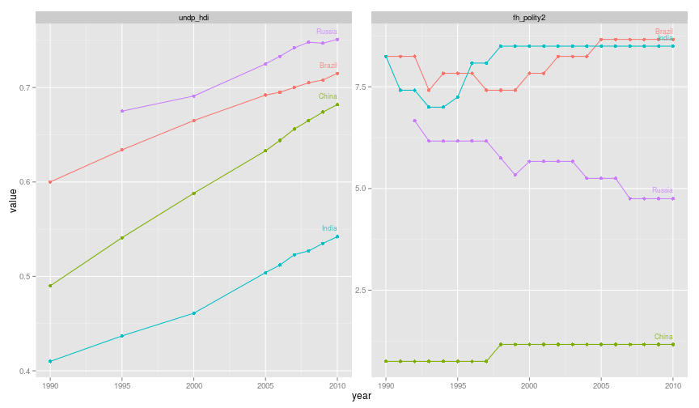
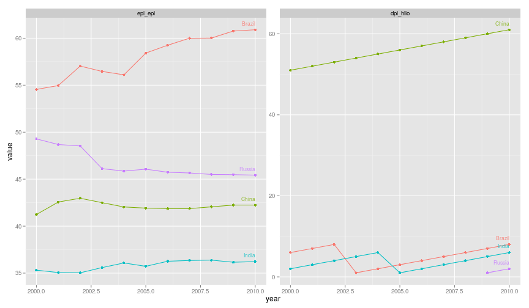
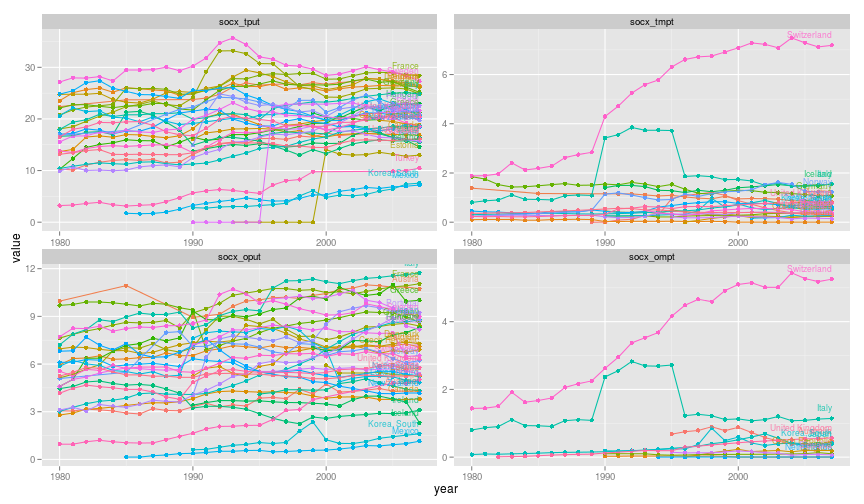
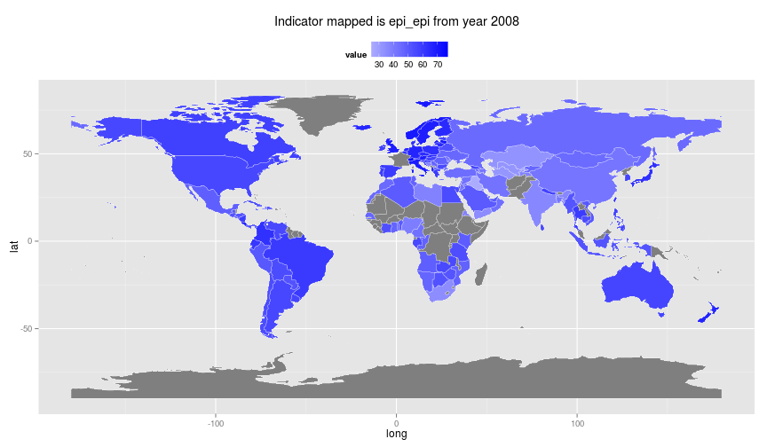

## rQog-package for R - Download data from the Quality of Government Institute data


**Note**: *Package is early phase of development and should be used with caution. Package is not yet submitted to CRAN and the code is hosted under [rOpenGov](http://ropengov.github.io/)-initiative at: [github.com/rOpenGov/rqog](https://github.com/rOpenGov/rqog).  Please join rOpenGov-community and submit your ideas as issues and concrete improvements as pull requests!*


```r
Sys.time()
```

```
## [1] "2014-10-01 20:15:15 EEST"
```

***

Quotation from [ Quality of Governance institute website](http://www.qog.pol.gu.se/)

>The QoG Institute was founded in 2004 by Professor Bo Rothstein and Professor Sören Holmberg. It is an independent research institute within the Department of Political Science at the University of Gothenburg. We conduct and promote research on the causes, consequences and nature of Good Governance and the Quality of Government (QoG) - that is, trustworthy, reliable, impartial, uncorrupted and competent government institutions.

>The main objective of our research is to address the theoretical and empirical problem of how political institutions of high quality can be created and maintained. A second objective is to study the effects of Quality of Government on a number of policy areas, such as health, the environment, social policy, and poverty. We approach these problems from a variety of different theoretical and methodological angles.

**Quality of Government institute** provides data in five different data sets, both in cross-sectional and longitudinal versions:

1. [QoG Basic Data](http://www.qog.pol.gu.se/data/datadownloads/qogbasicdata/)
2. [QoG Standard Data](http://www.qog.pol.gu.se/data/datadownloads/qogstandarddata/)
3. [QoG Social Policy Data](http://www.qog.pol.gu.se/data/datadownloads/qogsocialpolicydata/)
4. [QoG Expert Survey Data](http://www.qog.pol.gu.se/data/datadownloads/qogexpertsurveydata/) 
5. [QoG EU Regional Data](http://www.qog.pol.gu.se/data/datadownloads/qogeuregionaldata/)

**rqog**-package provides access to **Basic**, **Standard** and **Social Policy** datasets through function `read_qog()`. **Standard** data has all the same indicators as in **Basic** data (143 variables) and an additional 585 indicators. Both **basic** and **standard** datasets have 211 countries. **Social Policy** dataset has 1009 indicators from 40 countries. **rqog** uses *longitudinal* datasets by default that have time-series of varying duration from majority of the indicators and countries.

Quality of Government Institute provides codebooks for all datasets: 

1. [Basic data codebook](http://www.qogdata.pol.gu.se/codebook/codebook_basic_30aug13.pdf)
2. [Standard data codebook](http://www.qogdata.pol.gu.se/codebook/codebook_standard_15may13.pdf)) 
3. [Social Policy data codebook](http://www.qogdata.pol.gu.se/codebook/codebook_social_4apr12.pdf)

You consult the codebooks for description of the data and indicators.


## Installation


```r
library(devtools)
install_github(repo = "rqog", username = "ropengov")
library(rqog)
```

## Examples

### Basic Data

Basic data has a limited selection of most common indicators incluiding totally 143 variables. Below is an example on how to extract data on human development index and Democracy (Freedom House/Polity) index from BRIC-countries from 1990 to 2010 and plo


```r
library(rqog)
# Download a local coppy of the file
dat <- read_qog(which.data="basic")
# Subset the data
dat2 <- dat[dat$cname %in% c("Russia","China","India","Brazil"), ]
dat2 <- dat2[c("cname","year","undp_hdi","fh_polity2")]
dat2 <- dat2[dat2$year %in% 1990:2010,]
# melt to long format
library(reshape2)
dat.l <- melt(dat2, id.vars=c("cname","year"))
dat.l <- dat.l[!is.na(dat.l$value), ]
library(ggplot2)
# Plot the data
ggplot(dat.l, aes(x=year,y=value,color=cname)) + 
  geom_point() + geom_line() +
  geom_text(data=merge(dat.l,aggregate(year ~ cname, dat.l, max),
                     by=c("year","cname")),
          aes(x=year,y=value,label=cname),
          hjust=1,vjust=-1,size=3,alpha=.8) +
  facet_wrap(~variable, scales="free") +
  theme(legend.position="none")
```

 


### Standard data

Standard data includes a all the indicators 748 variables. Below is an example on how to extract data on *Environmental Performance Index*  and *Party of Chief Executive: How Long in Office* from BRIC-countries and plot it.


```r
library(rqog)
# Download a local coppy of the file
dat <- read_qog("standard")
# Subset the data
dat2 <- dat[dat$cname %in% c("Russia","China","India","Brazil"), ]
dat2 <- dat2[c("cname","year","epi_epi","dpi_hlio")]
dat2 <- dat2[dat2$year %in% 2000:2010,]
# melt to long format
library(reshape2)
dat.l <- melt(dat2, id.vars=c("cname","year"))
dat.l <- dat.l[!is.na(dat.l$value), ]
# Plot the data
library(ggplot2)
ggplot(dat.l, aes(x=year,y=value,color=cname)) + 
  geom_point() + geom_line() +
  geom_text(data=merge(dat.l,aggregate(year ~ cname, dat.l, max),
                     by=c("year","cname")),
          aes(x=year,y=value,label=cname),
          hjust=1,vjust=-1,size=3,alpha=.8) +
  facet_wrap(~variable, scales="free") +
  theme(legend.position="none")
```

 

### Social Policy data

Social Policy data includes 1009 variables, but from a smaller number of wealthier countries of 41. In the example below four indicators:

1. Total social expenditure (public) `socx_tput`
2. Total social expenditure (mandatory private) `socx_tmpt`
3. Old age expenditure (public) `socx_oput`
4. Old age expenditure (mandatory private) `socx_ompt`

We will include all the countries and all the years included in the data.


```r
library(rqog)
# Download a local coppy of the file
dat <- read_qog("social_policy")
# Subset the data
dat2 <- dat[c("cname","year","socx_tput","socx_tmpt","socx_oput","socx_ompt")]
# melt to long format
library(reshape2)
dat.l <- melt(dat2, id.vars=c("cname","year"))
dat.l <- dat.l[!is.na(dat.l$value), ]
library(ggplot2)
# Plot the data
ggplot(dat.l, aes(x=year,y=value,color=cname)) + 
  geom_point() + geom_line() +
  geom_text(data=merge(dat.l,aggregate(year ~ cname, dat.l, max),
                     by=c("year","cname")),
          aes(x=year,y=value,label=cname),
          hjust=1,vjust=-1,size=3,alpha=.8) +
  facet_wrap(~variable, scales="free") +
  theme(legend.position="none")
```

 


### Spatial visualisation of Quality of Government data

First I extract the *Enviromental Performance Index* from **Standard** data and merge it with map data using `joinCountryData2Map()`-funktion from [**rworldmap**](http://cran.r-project.org/web/packages/rworldmap/index.html), then fortify the `SpatialPolygonDataFrame` into regular `data.frame` using `fortify`-function from **ggplot2**,  and finally plot whole world using mercator projetion. Grey color stands for missing data.


```r
library(rqog)
dat <- read_qog("standard")
# Subset the data
dat2 <- dat[c("cname","year","epi_epi")]
dat2 <- dat2[dat2$year %in% 2008,]
# melt to long format
library(reshape2)
dat.l <- melt(dat2, id.vars=c("cname","year"))
dat.l <- dat.l[!is.na(dat.l$value), ]
# merge the data using rworldmap
library(rworldmap)
shape <- joinCountryData2Map(dat.l,joinCode = "NAME",nameJoinColumn = "cname")
```

```
## 125 codes from your data successfully matched countries in the map
## 7 codes from your data failed to match with a country code in the map
## 119 codes from the map weren't represented in your data
```

```r
# fortify the SpatialPolygonDataFrame into data.frame
library(ggplot2)
shape$id <- rownames(shape@data)
map.points <- fortify(shape, region = "id")
map.df <- merge(map.points, shape, by = "id")
# order the data for smooth plotting
map.df <- map.df[order(map.df$order), ]
# and plot
library(ggplot2)
ggplot(map.df, aes(long,lat,group=group)) +
  geom_polygon(aes(fill=value)) +
  geom_polygon(data = map.df, aes(long,lat), 
               fill=NA, 
               color = "white",
               size=0.1) + # white borders
  scale_fill_gradient2(low="white", high="blue")+
    theme(legend.position="top") +
  labs(title=paste("Indicator mapped is ",
                    as.character(dat.l[1, "variable"]),
                   " from year ",
                   as.character(dat.l[1, "year"]),
                    sep=""))
```

 

### Session info

This tutorial was created with


```r
sessionInfo()
```

```
## R version 3.1.1 (2014-07-10)
## Platform: x86_64-pc-linux-gnu (64-bit)
## 
## locale:
##  [1] LC_CTYPE=fi_FI.UTF-8       LC_NUMERIC=C              
##  [3] LC_TIME=fi_FI.UTF-8        LC_COLLATE=fi_FI.UTF-8    
##  [5] LC_MONETARY=fi_FI.UTF-8    LC_MESSAGES=fi_FI.UTF-8   
##  [7] LC_PAPER=fi_FI.UTF-8       LC_NAME=C                 
##  [9] LC_ADDRESS=C               LC_TELEPHONE=C            
## [11] LC_MEASUREMENT=fi_FI.UTF-8 LC_IDENTIFICATION=C       
## 
## attached base packages:
## [1] stats     graphics  grDevices utils     datasets  methods   base     
## 
## other attached packages:
##  [1] rworldmap_1.3-1 rqog_0.1.1      devtools_1.5    WDI_2.4        
##  [5] RJSONIO_1.3-0   mapproj_1.2-2   maps_2.3-7      rgeos_0.3-6    
##  [9] rgdal_0.8-16    maptools_0.8-30 sp_1.0-15       stringr_0.6.2  
## [13] reshape2_1.4    XML_3.98-1.1    ggplot2_1.0.0   rustfare_0.1.1 
## [17] servr_0.1.5     knitr_1.6.20   
## 
## loaded via a namespace (and not attached):
##  [1] codetools_0.2-9  colorspace_1.2-4 digest_0.6.4     evaluate_0.5.5  
##  [5] fields_7.1       foreign_0.8-61   formatR_1.0      grid_3.1.1      
##  [9] gtable_0.1.2     htmltools_0.2.6  httpuv_1.3.0     httr_0.5        
## [13] labeling_0.3     lattice_0.20-29  MASS_7.3-34      memoise_0.2.1   
## [17] mime_0.1.2       munsell_0.4.2    parallel_3.1.1   plyr_1.8.1      
## [21] proto_0.3-10     Rcpp_0.11.2      RCurl_1.95-4.3   rmarkdown_0.2.64
## [25] scales_0.2.4     spam_1.0-1       tools_3.1.1      whisker_0.3-2   
## [29] yaml_2.1.13
```


### STATA-package

*Christoph Thewes, from University of Potsdam* has already written a package for STATA users. [See details from QoG website](http://www.qog.pol.gu.se/data/dataextras/forstatausers/)


